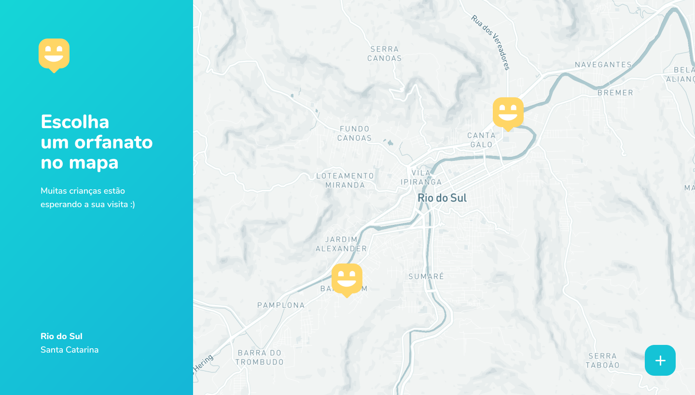
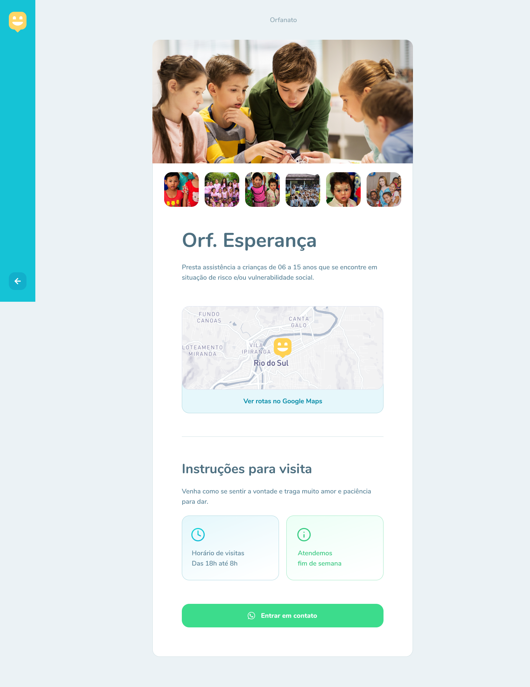
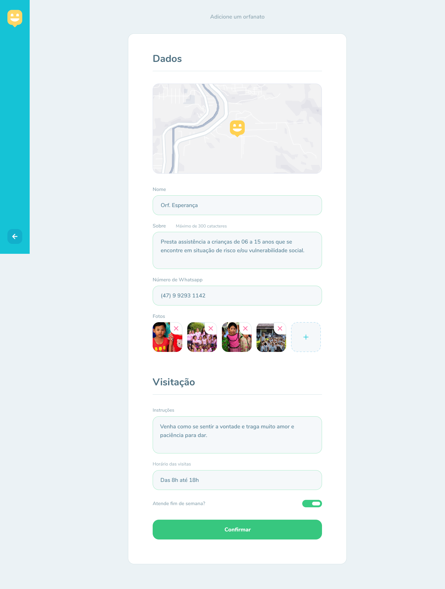
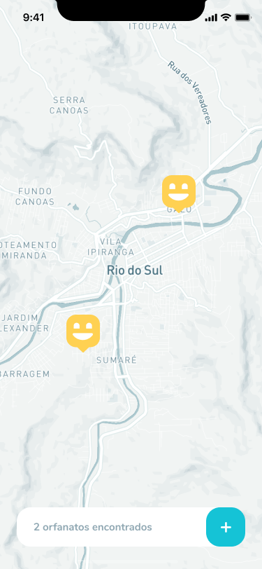

<div align="center">

# 

**Happy** é uma plataforma de cadastro e consulta de orfanatos em uma determinada região.
O projeto foi desenvolvido durante a terceira edição da _Next Level Week_, realizada pela [Rocketseat](https://github.com/Rocketseat), entre os dias 12 e 16 de Outubro de 2020.


---
</div>

# índice

- [Layout](#black_nib-layout)
  - [Web](#web-)
  - [Mobile](#mobile-)
- [Tecnologias](#technologist-tecnologias)
  - [Backend](#globe_with_meridians-backend)
  - [Web](#computer-web)
  - [Mobile](#iphone-mobile)
- [Iniciar Projeto](#arrow_forward-iniciando-o-projeto)
  - [Backend](#globe_with_meridians-backend-1)
  - [Web](#computer-web-1)
  - [Mobile](#iphone-mobile-1)


---

# 	:black_nib: Layout

## WEB [](https://www.figma.com/file/mDEbnoojksG4w8sOxmudh3/Happy-Web)


| HOME                             | MAPA                             |
| -------------------------------- | -------------------------------- |
|  |  |

| PERFIL                             | DADOS                             |
| ---------------------------------- | --------------------------------- |
|  |  |

## MOBILE [](https://www.figma.com/file/X27FfVxAgy9f5IFa7ONlph/Happy-Mobile)

| MAPA                                | PERFIL                                |
| ----------------------------------- | ------------------------------------- |
|  |  |


---

# :technologist: Tecnologias

## :globe_with_meridians: Backend

O _back-end_ da aplicação foi desenvolvido com a linguagem/superset [Typescript](https://www.typescriptlang.org/) usando o framework [NodeJS](https://nodejs.org/en/). O banco de dados escolhido foi o [SQLite](https://sqlite.org/index.html) pela facilidade de configuração, para criar tabelas e adicionar novas colunas foi usado o ORM [typeorm](https://typeorm.io/#/). Foi usado também o pacote [Yup]() para validação de requests.

## :computer: Web

A versão _web_ da aplicação foi desenvolvida com a linguagem/superset [Typescript](https://www.typescriptlang.org/) usando o framwork [ReactJS](https://reactjs.org/). O _mapa_ foi feito com a biblioteca [Leaflet](https://leafletjs.com/) e as imagens usando a api do [MapBox](https://www.mapbox.com/) (Tambem foi testada a api grátis do [OpenStreetMap](https://www.openstreetmap.org/)). As chamadas api ao backend foram feitas com o [axios](https://www.npmjs.com/package/axios).

## :iphone: Mobile

A versão _mobile_ da aplicação foi desenvolvido com a linguagem/superset [Typescript](https://www.typescriptlang.org/) usando o framework [React Native](https://reactnative.dev/) e as ferramentas do [Expo](https://expo.io/).

---

# :arrow_forward: Iniciando o projeto

## :globe_with_meridians: Backend

Para iniciar o projeto sera necessário ter instalado o [NodeJS](https://nodejs.org/en/) e [npm](https://www.npmjs.com/)/[yarn](https://yarnpkg.com/)

### instalar dependencias

_yarn_
```
$ yarn install
```
_npm_
```
$ npm install
```

### configurações do banco de dados

_yarn_
```
$ yarn typeorm migration:run
```
_npm_
```
$ npm typeorm migration:run
```

### iniciar servidor de desenvolvimento

_yarn_
```
$ yarn dev
```
_npm_
```
$ npm dev
```

## :computer: Web

Para iniciar o projeto sera necessário ter instalado o [NodeJS](https://nodejs.org/en/), [ReactJS](https://reactjs.org/) e [npm](https://www.npmjs.com/)/[yarn](https://yarnpkg.com/)

### instalar dependencias

_yarn_
```
$ yarn install
```
_npm_
```
$ npm install
```

### iniciar servidor de desenvolvimento

_yarn_
```
$ yarn start
```
_npm_
```
$ npm start
```

### compilar para produção

_yarn_
```
$ yarn build
```
_npm_
```
$ npm build
```
> os arquivos estáticos para web ficarão salvos na pasta `public`

## :iphone: Mobile

Para iniciar o projeto sera necessário ter instalado o [React Native](https://reactnative.dev/), [Expo](https://expo.io/) e [npm](https://www.npmjs.com/)/[yarn](https://yarnpkg.com/). Será necessário tambem ter um cliente do expo instalado em um celular físico ou em um emulador.

### instalar dependencias

_yarn_
```
$ yarn install
```
_npm_
```
$ npm install
```

### iniciar cliente de desenvolvimento

```
$ expo start
```